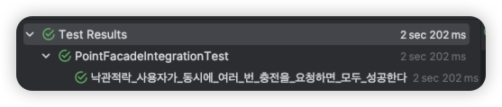
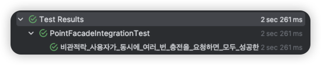
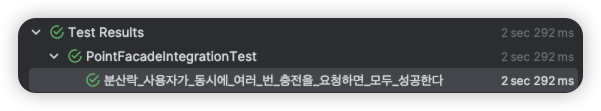
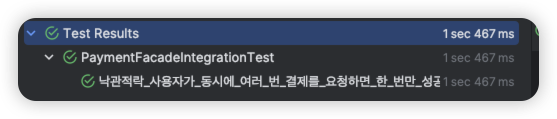
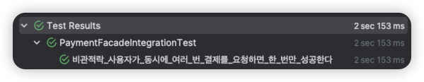
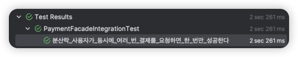
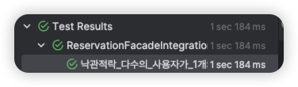
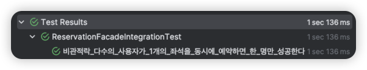
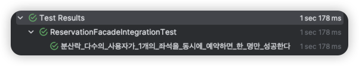

# 동시성 제어 분석 보고서

목차
1. 동시성 제어란?
2. 동시성 제어 기법
   1. synchronized
   2. concurrent hash map
   3. 낙관적락
   4. 비관적락
   5. 분산락
   6. 카프카
3. 포인트 충전 시 동시성 제어
4. 결제 시 동시성 제어
5. 예약 시 동시성 제어

---

## 동시성 제어란?


---

## 동시성 제어 기법
### 1. synchronized
- Java 에서 제공하는 기본적인 동시성 제어 프로그래밍 방법이다.
- 메서드나 블록 단위로 `synchronized` 키워드를 걸어 싱글 스레드 방식으로 동시성 제어가 가능하다.
- **장점**: 구현 난이도가 낮다.
- **단점**: 성능이 낮다. 메서드에 진입하기 위해 앞의 스레드 작업을 기다리기 때문이다. 단일 스레드 환경으로 처리하기에 분산환경에서는 적합하지 않다.

### 2. concurrent hash map
- `synchronized`방식보다 개선된 방법으로, 데이터별로 Lock을 걸어 메서드 전체에 잠금을 거는 synchronized 보다 성능이 좋다.
- **장점**: 구현 난이도가 낮고 synchronized 보다 성능이 좋다.
- **단점**: 분산 환경에서 적합하지 않다.

### 3. optimistic lock (낙관적락)
- 낙관적락(Optimistic Lock)은 DB의 Lock을 사용하지 않고 Version 관리를 통해 Application Level에서 처리한다.
- JPA가 제공하는 버전 관리 기능을 사용하여 최초 하나의 요청만 성공하고 나머지 요청은 `ObjectOptimisticLockingFailureException` 예외가 발생한다.
- 수정 시 version 값을 확인하여 다른 트랜잭션이 동일한 조건으로 값을 "수정할 때" 실패 처리를 한다.
- 데이터를 읽을 때에는 다른 트랜잭션이 데이터를 수정하지 않을 것으로 가정하고 락을 걸지 않는다.
- **장점**: 트랜잭션을 필요로 하지 않아 비관적락보다 상대적으로 성능이 높을 수 있다.
- **단점**: 버전 충돌 발생 시 재시도 로직을 추가해야 하고, 충돌이 자주 발생하는 상황에서는 재시도조차 실패할 수 있어 딜레마에 빠질 수 있다. 또한 순차 보장이 안된다.
- 사례: 읽기 비율이 높은 곳, 일반적으로 웹 애플리케이션은 읽기 수행작업이 많기 때문에 주로 사용된다.

### 4. pessimistic lock (비관적락)
- 비관적락(Pessimistic Lock)은 데이터를 읽을 때 해당 row에 대한 락을 걸어 다른 트랜잭션이 해당 데이터를 변경할 수 없게 한다.
- 데이터를 읽을 때 `SELECT FOR UPDATE`와 같은 쿼리를 사용하여 배타락(Exclusive Lock)을 획득하고, Transaction Commit(혹은 Rollback) 되는 시점에 반납한다.
- **장점**: 데이터의 일관성과 무결성을 지키기 용이하고, 충돌에 대한 오버헤드가 준다.
- **단점**: 모든 트랜잭션에 대해 Lock을 사용하여 성능 저하와 데드락 발생 가능성이 높다.
- 사례: 수정 비율이 높은 곳, 데이터의 일관성이 중요한 금융 시스템에서 주로 사용된다.

### 5. distributed lock (분산락)
- 분산락(Distributed Lock)은 서로 다른 프로세스가 상호 배타적인 방식으로 공유 리소스와 함께 작동해야 하는 많은 환경에서 유용한 Lock이다.
- 락을 획득한 프로세스 혹은 스레드만이 공유 자원 / Critical Section 에 접근할수 있도록 한다.   
<br>
- Redis 를 활용한 분산락을 이용할 것이므로 이에 초점을 맞춰 작성하도록 하겠다.
- Redis 분산락 클라이언트: `Lettuce`, `Redisson`   
<br>   
- `Lettuce`: 
  - `Setnx 명령어`를 활용하여 분산락을 구현한다. (Set if not Exist - key:value를 Set할 때, 기존의 값이 없을 때만 Set하는 명령)
  - 특징: Setnx 명령어 사용을 위해 반복문을 통해 `Spin Lock`방식으로 구현해야 하여 레디스에 부하를 준다.   
- `Redisson`:
  - 메시지에 대한 `publish & subscribe`를 지원한다. (메시지 브로커 역할)
  - 락이 해제되는 시점에 구독중인 스레드에게 이벤트를 보내 Spin Lock 방식에 비해 레디스 부하가 덜하다.
  - 락 획득 대기시간, 락 획득 후 점유시간에 대한 설정이 가능하여 간편하고 효율적으로 윤영을 할 수 있다.
<br>
- **장점**: 서버 분산 환경에서도 프로세스들의 원자적 연산이 가능하다. 기본적으로 Redis는 인메모리 DB 이기에 더 빠르게 락 획득 및 해제가 가능하다. DB 커넥션 풀 문제를 해결한다.
- **단점**: 레디스 서버가 다운되면 단일 장애 지점이 될 수 있다.
- 사례: 애플리케이션 서버나 DB 서버가 분산되어 있을 때 주로 사용한다.

### 6. kafka
- 카프카는 분산 스트리밍 플랫폼으로, 대규모 데이터 스트리밍을 처리하는데 유용한 도구이다.
- 프로듀서, 컨슈머, 브로커, 토픽 등의 개념으로 구성된다. 프로듀서는 데이터를 생성하고, 컨슈머는 데이터를 소비한다. 브로커는 데이터를 저장하고 관리하며, 토픽은 데이터를 분류하는 단위이다.
- 파티션 키를 활용 / 컨슈머 오프셋을 활용 / 트랜잭션을 활용 / 데이터 복제를 활용하여 동시성 이슈를 해결할 수 있다.
- **장점**: 높은 처리량과 낮은 지연 시간, 데이터 내구성 보장, 높은 확장성
- **단점**: 구현 비용이 크다.
---

## `포인트 충전`에서의 동시성 제어

### 요구사항 분석
- 예시
```text
한 명의 사용자가 포인트 충전을 여러번 요청한다. (amount: 1000, userId: 1)
이 때, 충전에 대한 여러 번의 요청을 어떻게 해석할 것인가에 따라 동시성 제어 기법이 달라진다고 생각한다.
1. 충전은 송금과 같은 개념이어서, 잔액이 충분하다면 누락되거나 실패하지 않게 모두 성공으로 처리한다.
=> 비관적락 사용
2. 충전을 여러 번 요청한 것은 단순 따닥 이슈로, 한 번만 성공하는 것이 맞다.
=> 낙관적락/분산락 사용
```

- `PointFacade.java`
```java
public Point chargePoint(Long userId, Long amount) {
    userService.existsUser(userId);
    return pointService.chargePoint(userId, amount);
}
```
- `PointService.java`
```java
@Transactional
public Point chargePoint(Long userId, Long amount) {    
    Point point = pointRepository.findPoint(userId);
    Point updatedPoint = point.charge(amount);
    pointRepository.save(updatedPoint);
    return updatedPoint;
}
```

### 낙관적락   
> 동시에 여러 번 충전을 요청하는 경우를 클라이언트의 잘못된 중복 요청으로 간주할 때 낙관적락 사용

```java
package hhplus.concert.infra.entity;

@Entity(name = "point")
public class PointEntity {

    @Id
    @GeneratedValue(strategy = GenerationType.IDENTITY)
    private Long id;
    
    // 생략 ...

    @Version
    @ColumnDefault("0") // 필자는 엔티티와 도메인 모델이 분리되어 있어 자동으로 Version 관리가 어려워 Default 값을 명시했다.
    private Long version;
}
```
- 충전 요청 시 `amount` 값을 변경하게 되는데, `@Version`을 추가하여 엔티티에 변경이 있을 시 version 이 자동으로 증가할 수 있도록 한다.

#### 테스트 결과
```java
 @Test
 @Transactional
 void 낙관적락_사용자가_동시에_여러_번_충전을_요청하면_모두_성공한다() throws InterruptedException {
     // given
     long chargeAmount = 100L;

     // when
     AtomicInteger successCnt = new AtomicInteger(0);
     AtomicInteger failCnt = new AtomicInteger(0);

     final int threadCount = 100;
     final CountDownLatch countDownLatch = new CountDownLatch(threadCount);

     for(int i = 0; i < threadCount; i++) {
         new Thread(() -> {
             try {
                 pointFacade.chargePoint(USER_ID, chargeAmount);
                 successCnt.incrementAndGet();
             } catch(Exception e) {
                 logger.warn(e.getMessage());
                 failCnt.incrementAndGet();
             }
             finally {
                 countDownLatch.countDown();
             }
         }).start();
     }
     countDownLatch.await();

     Thread.sleep(1000);

     Point point = pointFacade.getPoint(USER_ID);

     // 충전 성공 횟수가 한 번인지 검증한다.
     assertThat(successCnt.intValue()).isOne();
     // 충전된 금액의 정합성이 보장되는지 검증한다.
     assertThat(chargeAmount * successCnt.intValue()).isEqualTo(point.amount());
 }
```
- 낙관적락을 적용하여 version 을 체크하기 때문에 충전 요청이 여러 번 수행될 경우 1번만 성공한다.
- 1번만 성공하기 때문에 충전 후 금액이 충전값 * 1 과 같다.

- 소요 시간: 2s ~ 2.2s

### 비관적락
> 모든 충전 요청을 수행해야 한다면 비관적락을 사용한다.

```java
public interface PointJpaRepository extends JpaRepository<PointEntity, Long> {

    @Lock(LockModeType.PESSIMISTIC_WRITE)
    Optional<PointEntity> findByUserId(Long userId);
}
```

#### 테스트 결과
- `PointFacadeIntegrationTest.java`
```java
 @Test
 @Transactional
 void 비관적락_사용자가_동시에_여러_번_충전을_요청하면_모두_성공한다() throws InterruptedException {
     // given
     long chargeAmount = 100L;

     // when
     AtomicInteger successCnt = new AtomicInteger(0);
     AtomicInteger failCnt = new AtomicInteger(0);

     final int threadCount = 100;
     final CountDownLatch countDownLatch = new CountDownLatch(threadCount);

     for(int i = 0; i < threadCount; i++) {
         new Thread(() -> {
             try {
                 pointFacade.chargePoint(USER_ID, chargeAmount);
                 successCnt.incrementAndGet();
             } catch(Exception e) {
                 logger.warn(e.getMessage());
                 failCnt.incrementAndGet();
             }
             finally {
                 countDownLatch.countDown();
             }
         }).start();
     }
     countDownLatch.await();

     Thread.sleep(1000);

     Point point = pointFacade.getPoint(USER_ID);

     // 충전 요청 성공 횟수가 스레드 갯수와 같은지 검증한다.
     assertThat(threadCount).isEqualTo(successCnt.intValue());
     // 충전된 금액의 정합성이 보장되는지 검증한다.
     assertThat(chargeAmount * successCnt.intValue()).isEqualTo(point.amount());
 }
```
- 모든 충전 요청에 대해 락이 걸려있다면 해제될 때까지 대기 후 순차적으로 수행하여 모두 성공할 수 있도록 한다.   

- 소요 시간: 2.1s ~ 2.2s

### 분산락
```java
@Aspect
@Component
@RequiredArgsConstructor
@Slf4j
public class DistributedLockAop {

    private static final String REDISSON_LOCK_PREFIX = "LOCK:";

    private final RedissonClient redissonClient;
    private final AopForTransaction aopForTransaction;

    @Around("@annotation(hhplus.concert.support.aop.DistributedLock)")
    public Object lock(final ProceedingJoinPoint joinPoint) throws Throwable {
        MethodSignature signature = (MethodSignature) joinPoint.getSignature();
        Method method = signature.getMethod();
        DistributedLock distributedLock = method.getAnnotation(DistributedLock.class);

        // @DistributedLock 어노테이션의 파라미터 값을 가져온다.
        String key = REDISSON_LOCK_PREFIX + CustomSpringELParser.getDynamicValue(signature.getParameterNames(), joinPoint.getArgs(), distributedLock.key());
       // 락의 이름 (key)로 RLock 인스턴스를 가져온다.
        RLock rLock = redissonClient.getLock(key);

        try {
           // 정의된 waitTime 까지 획득을 시도하고, 정의된 leaseTime 이 지나면 잠금을 해제한다.
            boolean available = rLock.tryLock(distributedLock.waitTime(), distributedLock.leaseTime(), distributedLock.timeUnit());  // (2)
            if (!available) {
                return false;
            }
            // @DistributedLock 어노테이션이 선언된 메서드를 별도의 트랜잭션으로 실행한다.
            return aopForTransaction.proceed(joinPoint);
        } catch (InterruptedException e) {
            throw new InterruptedException();
        } finally {
            try {
                // 종료시 무조건 락을 해제한다.
                rLock.unlock();
            } catch (IllegalMonitorStateException e) {
                log.info("Redisson Lock Already UnLock serviceName: {}, key: {}", method.getName(), key);
            }
        }
    }
}
```
```java
@Component
public class AopForTransaction {
    
    // @DistributedLock 이 선언된 메서드는 Propagation.REQUIRES_NEW 옵션을 지정하여
    // 부모 트랜잭션의 유무에 관계없이 별도의 트랜잭션으로 동작하게끔 설정한다.
    @Transactional(propagation = Propagation.REQUIRES_NEW)
    public Object proceed(final ProceedingJoinPoint joinPoint) throws Throwable {
        return joinPoint.proceed();
    }
}

```
- 정의한 @DistributedLock 어노테이션을 사용할 파사드 메서드에 걸고, 매개값에 `String lockName`으로 락을 걸 키 값을 가져와 처리한다.

#### 테스트 결과

- 소요 시간: 2.3s

### 결론

---

## `결제`에서의 동시성 제어

### 요구사항 분석
- 예시
```text
한 명의 사용자가 동일한 예약 건에 대하여 동시다발적으로 결제를 요청한다. (reservationId: 1, userId: 1)
결제 요청에 대한 비즈니스 로직은 다음과 같다.
1. 이미 결제된 건인지 확인한다.
2. 예약한지 5분 안에 결제 요청이 시도되었는지 확인한다.
3. 예약자와 결제 요청자가 동일한지 확인한다.
4. 포인트 잔액을 확인한다.
5. 잔액이 충분하다면 결제 금액을 차감한다.
6. 예약 상태를 완료로 변경한다.
7. 변경된 포인트 정보를 저장한다. 
8. 토큰을 만료 상태로 변경한다.

고려해야 할 점은 다음과 같다.
- 동일한 예약에 대해서는 *단 한 번만* 결제할 수 있다.

동시에 여러 번의 결제 요청이 들어올 때, 첫 결제 요청이 성공한다면 나머지는 "실패"로 간주하고 더 이상 결제되지 않도록 구현한다.
```

- `PaymentFacade.java`
```java
 @Transactional
 public Payment payment(String token, Long reservationId, Long userId) {
     // 예약 검증 (본인인지, 시간 오버 안됐는지)
     Reservation reservation = reservationService.checkReservation(reservationId, userId);
     Seat seat = concertService.getSeat(reservation.seatId());
     Point point = pointService.getPoint(userId);
     // 잔액을 변경한다.
     pointService.usePoint(point, seat.seatPrice());
     // 예약 상태를 변경한다.
     Reservation reserved = reservationService.changeStatus(reservation, ReservationStatus.COMPLETED);
     // 결제 완료 시 토큰을 만료로 처리한다.
     Queue queue = queueService.getToken(token);
     queueService.expireToken(queue);
     // 결제 내역을 생성한다.
     return paymentService.createBill(reserved.id(), userId, seat.seatPrice());
 }
```

- `PaymentPacadeIntegrationTest.java`
```java
 @Test
 void 낙관적락_사용자가_동시에_여러_번_결제를_요청하면_한_번만_성공한다() throws InterruptedException {
     // given
     pointService.chargePoint(USER_ID, 100_000L);

     // when
     AtomicInteger successCnt = new AtomicInteger(0);
     AtomicInteger failCnt = new AtomicInteger(0);

     final int threadCount = 100;
     final CountDownLatch countDownLatch = new CountDownLatch(threadCount);

     for(int i = 0; i < threadCount; i++) {
         new Thread(() -> {
             try {
                 paymentFacade.payment(token, reservation.id(), USER_ID);
                 successCnt.incrementAndGet();
             } catch(Exception e) {
                 logger.warn(e.getMessage());
                 failCnt.incrementAndGet();
             }
             finally {
                 countDownLatch.countDown();
             }
         }).start();
     }
     countDownLatch.await();

     Thread.sleep(1000);

     // 결제 요청이 한 번만 수행됐는지 검증한다.
     assertThat(successCnt.intValue()).isOne();
     // 실패한 횟수가 threadCount 에서 성공한 횟수를 뺀 값과 같은지 검증한다.
     assertThat(failCnt.intValue()).isEqualTo(threadCount - successCnt.intValue());
     // 결제 후 잔액이 충전금액 - 사용금액 인지 검증한다.
     Point point = pointService.getPoint(USER_ID);
     assertThat(point.amount()).isEqualTo(100_000L - 10_000L);
 }
```
> 100개의 스레드풀을 생성하여 동일한 예약에 대한 결제 요청을 동시에 100번 수행한다.
> 이후 결제 요청이 한 번만 성공했는지, 나머지는 실패하였는지 검증한다.
> 결제 후 잔액이 충전 금액에서 결제 금액을 뺀 금액과 같은지 확인한다.

### 낙관적락
```java
package hhplus.concert.infra.entity;

@Entity(name = "reservation")
public class ReservationEntity {

    @Id
    @GeneratedValue(strategy = GenerationType.IDENTITY)
    private Long id;
    
    // ... 생략

    @Column(nullable = false)
    @Enumerated(value = EnumType.STRING)
    private ReservationStatus status;

    @Version
    @ColumnDefault("0")  // 필자는 엔티티와 도메인 모델이 분리되어 있어 자동으로 Version 관리가 어려워 Default 값을 명시했다.
    private Long version;
}
```
- 결제 정상 처리 시 예약 엔티티의 `status`를 `COMPLETED`로 변경하기 때문에, `reservation` Entity 에 `@Version`을 추가하여 변경 시 version 이 자동으로 증가할 수 있도록 한다.   
<br>
- `ReservationJpaRepository.java`
```java
@Lock(LockModeType.OPTIMISTIC)
@Query("select r from reservation r where r.id = ?1")
Optional<ReservationEntity> findByReservationId(Long reservationId);
```
- 예약을 조회할 때 사용되는 메서드이다.
- 트랜잭션 시작 후, 해당 예약에 버전 관리를 수행할 수 있도록 `@Lock(LockModeType.OPTIMISCTIC)` 어노테이션을 사용해 **낙관적락**을 적용한다.

#### 테스트 결과

- 소요 시간: 1.4s ~ 1.5s
```text
2024-10-31T20:59:00.572+09:00  WARN 96922 --- [      Thread-19] h.c.a.f.PaymentFacadeIntegrationTest     : 해당 예약건은 이미 결제되었습니다.
2024-10-31T20:59:00.572+09:00  WARN 96922 --- [       Thread-9] h.c.a.f.PaymentFacadeIntegrationTest     : Row was updated or deleted by another transaction (or unsaved-value mapping was incorrect) : [hhplus.concert.infra.entity.ReservationEntity#1]
```
- 버전 충돌으로 `ObjectOptimisticLockingFailureException`이 발생한 것을 확인할 수 있다.
- 보통 낙관적락 사용시 try-catch 구문으로 위 예외를 잡아 재시도 로직을 구현하지만, 결제가 성공하면 결제를 취소하기 전까지는 다시 결제할 수 없으니 재처리는 구현하지 않았다.

---
### 비관적락
```java
public interface ReservationJpaRepository extends JpaRepository<ReservationEntity, Long> {
    
    
    @Lock(LockModeType.PESSIMISTIC_WRITE)
    @Query("select r from reservation r where r.id = ?1")
    Optional<ReservationEntity> findByReservationId(Long reservationId);
}
```
- 예약을 조회할 때 사용되는 메서드이다.
- 트랜잭션이 시작될 때 해당 row 에 락을 걸어, 다른 트랜잭션이 읽거나 쓸 수 없도록 방지한다.

#### 테스트 결과
   
- 소요 시간: 2.1s ~ 2.2s

### 분산락
#### 테스트 결과

- 소요 시간: 2.2s ~ 2.3s

### 결론

---

## `예약`에서의 동시성 제어
### 요구사항 분석
```text
다수의 사용자가 같은 콘서트의 같은 일정, 같은 좌석에 대한 예약을 동시다발적으로 요청한다. (`concertId`:1, `scheduleId`:1, `seatId`:1)
예약 요청에 대한 비즈니스 로직은 다음과 같다.
1. 해당 콘서트 일정이 예약 가능한 시간인지 검증한다.
2. 해당 좌석이 예약 가능한 상태인지 조회한다.
3. 좌석이 예약 가능 상태라면, 좌석을 점유하여 좌석의 상태를 예약 불가능으로 변경한다.
4. 예약 정보를 생성한다.

고려해야할 점은 다음과 같다.
- 동일한 일정의 동일한 좌석에 대해서는 *단 한 명만* 좌석을 점유할 수 있다.

동시에 다수의 요청자가 예약을 요청할 때, 한 명이 성공한다면 나머지는 "실패"로 간주하고 예약을 진행하지 않도록 구현한다.
예약 가능 상태인지 확인하는 부분(concertService.isAvailableReservation();)에서 예외를 던지도록 구현했다.
```

- `ReservationFacade.java`
```java
@Transactional
public ReservationResult reservation(ReservationCommand command) {
    // 콘서트 상태 조회
    ConcertSchedule schedule = concertService.scheduleInfo(command.scheduleId());
    Seat seat = concertService.getSeat(command.seatId());
    // 예약 가능 상태인지 확인
    concertService.isAvailableReservation(schedule, seat);
    // 좌석 점유
    concertService.assignmentSeat(seat);
    // 예약 정보 저장
    Reservation reservation = reservationService.reservation(schedule, seat, command.userId());
    // 예약 정보 리턴
    return ReservationResult.from(reservation, schedule, seat);
}
``` 
- `Seat.java`
```java
public void checkStatus() {
    if (status.equals(SeatStatus.UNAVAILABLE)) { // 사용 불가능한 좌석이라면 예외를 던진다.
        throw new CoreException(ErrorType.SEAT_UNAVAILABLE, "좌석 상태: " + status);
    }
}
```

- `ReservationRacadeIntegerationTest.java`
```java
@Test
void 다수의_사용자가_1개의_좌석을_동시에_예약하면_한_명만_성공한다() throws InterruptedException {
    // when
    final int threadCount = 100;
    final ExecutorService executorService = Executors.newFixedThreadPool(threadCount);
    final CountDownLatch countDownLatch = new CountDownLatch(threadCount);

    for (long l = 1; l <= threadCount; l++) {
        // 좌석 예약 요청 객체 생성
        ReservationCommand command = ReservationCommand.builder()
                .userId(l)
                .concertId(1L)
                .scheduleId(1L)
                .seatId(1L)
                .build();

        executorService.submit(() -> {
            try {
                // 좌석 예약 호출
                reservationFacade.reservation(command);
            } catch (Exception e) {
                logger.warn(e.getMessage(), e);
            } finally {
                countDownLatch.countDown();
            }
        });

    }
    countDownLatch.await();

    List<Reservation> reservations = reservationRepository.findByConcertIdAndScheduleIdAndSeatId(1L, 1L, 1L);
    // 같은 콘서트 같은 일정 같은 좌석으로 예약이 하나만 잡혔는지 검증한다.
    assertThat(reservations.size()).isOne();
    // 해당 좌석이 UNAVAILABLE 상태로 변경되었는지 검증한다.
    assertThat(concertRepository.findSeat(1L).status()).isEqualTo(SeatStatus.UNAVAILABLE);
}
```
> 100개의 스레드풀을 생성하여 동일한 좌석에 대한 예약 요청을 동시에 100번 수행한다.
> 이후 예약 테이블을 조회하여 해당 좌석에 대한 예약이 하나만 생성되었는지 검증하고, 해당 좌석의 상태가 `UNAVAILABLE` 로 변경되었는지 검증한다.
---
### 낙관적락
```java
package hhplus.concert.infra.entity;

@Entity(name = "seat")
public class SeatEntity {
    @Id
    @GeneratedValue(strategy = GenerationType.IDENTITY)
    private Long id;
    
    // ... 생략

    @Column(nullable = false)
    @Enumerated(value = EnumType.STRING)
    private SeatStatus status;

    @Version
    @ColumnDefault("0")
    private Long version;
}
```
- 예약 성공 시 좌석의 상태 `status`를 `AVAILABLE`로 변경하기 때문에, `seat` Entity 에 `@Version`을 추가하여 변경 시 version 이 자동으로 증가할 수 있도록 한다.
---
```java
public interface SeatJpaRepository extends JpaRepository<SeatEntity, Long> {

    @Lock(LockModeType.OPTIMISTIC)
    @Query("select s from seat s where s.id = ?1")
    Optional<SeatEntity> findBySeatId(Long seatId);
}
```
- 좌석을 조회할 때 사용되는 메서드이다. 
- 트랜잭션 시작 후, 해당 좌석에 버전 관리를 수행할 수 있도록 `@Lock(LockModeType.OPTIMISCTIC)` 어노테이션을 사용해 **낙관적락**을 적용한다.
- (근데 이 어노테이션 붙이지 않아도 테스트는 성공적으로 수행됩니다. . .)

#### 테스트 결과

- 소요 시간: 1.1s ~ 1.2s
```
2024-10-31T19:52:28.894+09:00  WARN 95645 --- [ool-2-thread-22] h.c.a.f.ReservationFacadeIntegrationTest : 
Row was updated or deleted by another transaction (or unsaved-value mapping was incorrect) : [hhplus.concert.infra.entity.SeatEntity#1]
org.springframework.orm.ObjectOptimisticLockingFailureException: Row was updated or deleted by another transaction (or unsaved-value mapping was incorrect) : 
[hhplus.concert.infra.entity.SeatEntity#1]
```
- 버전 충돌으로 `ObjectOptimisticLockingFailureException`이 발생한 것을 확인할 수 있다.
- 보통 낙관적락 사용시 try-catch 구문으로 위 예외를 잡아 재시도 로직을 구현하지만, 예약이 성공하면 결제가 5분 안에 이루어지지 않는 경우에 다시 예약이 가능하므로 예외 처리는 구현하지 않았다.

### 비관적락
```java
public interface SeatJpaRepository extends JpaRepository<SeatEntity, Long> {

    @Lock(LockModeType.PESSIMISTIC_WRITE)
    @Query("select s from seat s where s.id = ?1")
    Optional<SeatEntity> findBySeatId(Long seatId);
}
```
- 좌석을 조회하는 메서드이다.
- 트랜잭션 시작 시 해당 row 에 락을 걸어 다른 트랜잭션에서 읽거나 쓰지 못하게 한다.

#### 테스트 결과

- 소요 시간: 2s ~ 2.2s

### 분산락
#### 테스트 결과

- 소요 시간: 1.2s

### 결론
| 기능 | 락 종류  | 성능   | 복잡도 |
|----|-------|------|-----|
| 충전 | 낙관적 락 | 2.1s | 낮음  |
|    | 비관적 락 | 2.1s | 보통  |
|    | 분산 락  | 2.3s | 높음  |
| 결제 | 낙관적 락 | 1.4s | 낮음  |
|    | 비관적 락 | 2.1s | 보통  |
|    | 분산 락  | 2.2s | 높음  |
| 예약 | 낙관적 락 | 1.1s | 보통  |
|    | 비관적 락 | 2.1s | 높음  |
|    | 분산 락  | 1.2s | 높음  |

- **충전**은 모든 요청이 성공할 수 있게 비관적락을 사용한다.
- **결제**와 **예약**은 데이터베이스 커넥션 부하를 줄일 수 있고, 동시성 제어라는 부가적인 기능을 AOP 로 구현하여 처리할 수 있는 Redisson 분산락을 활용한다.